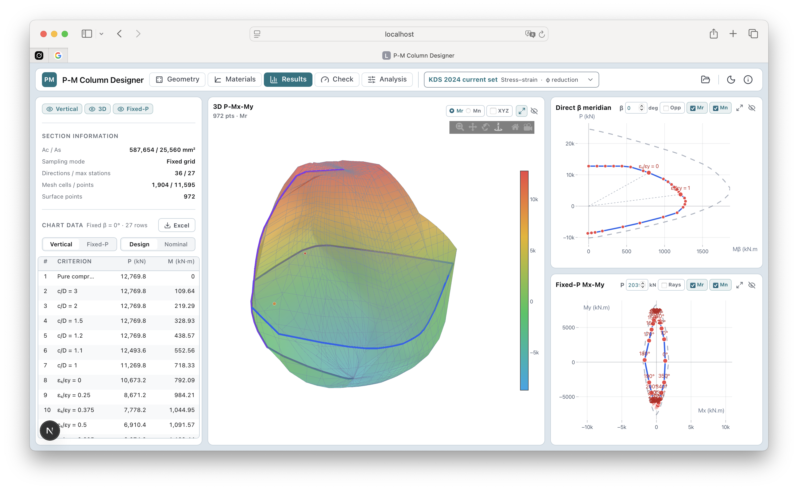
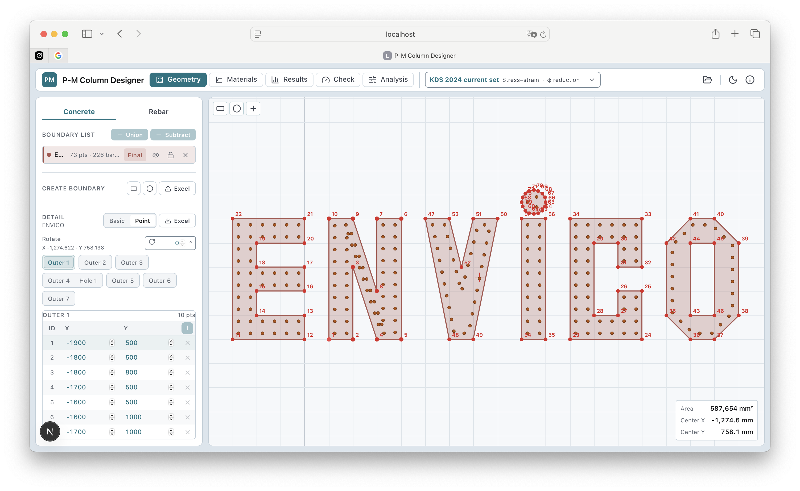
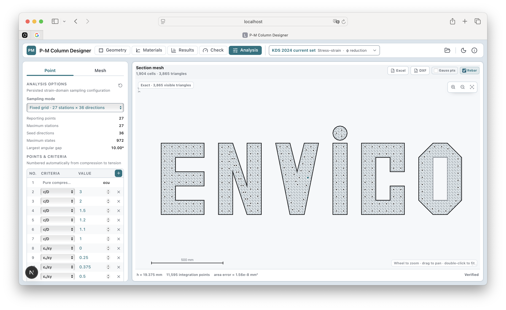
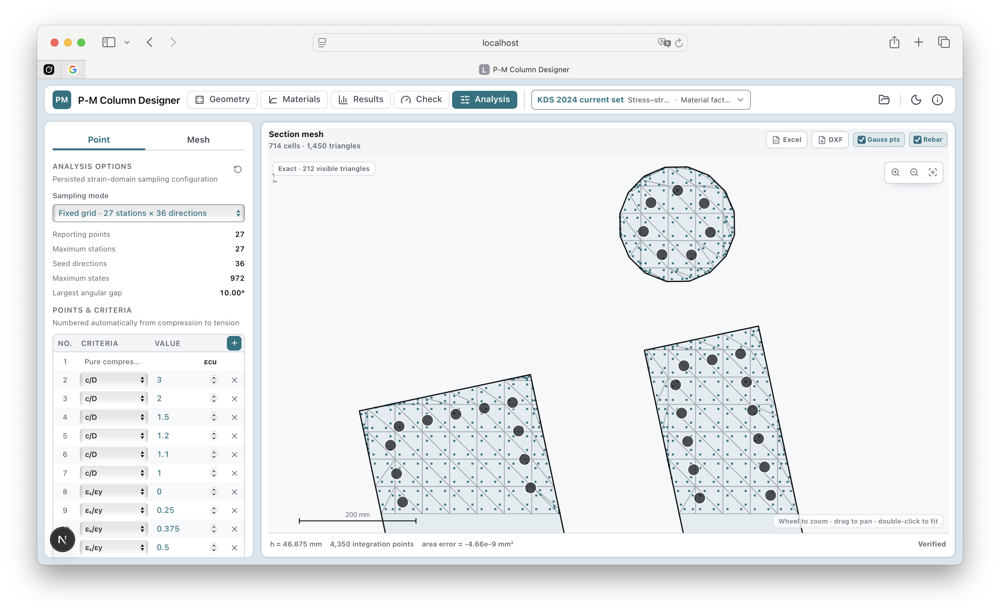
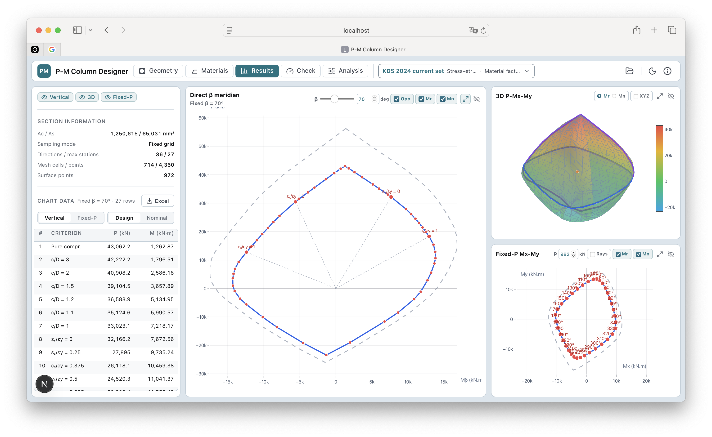
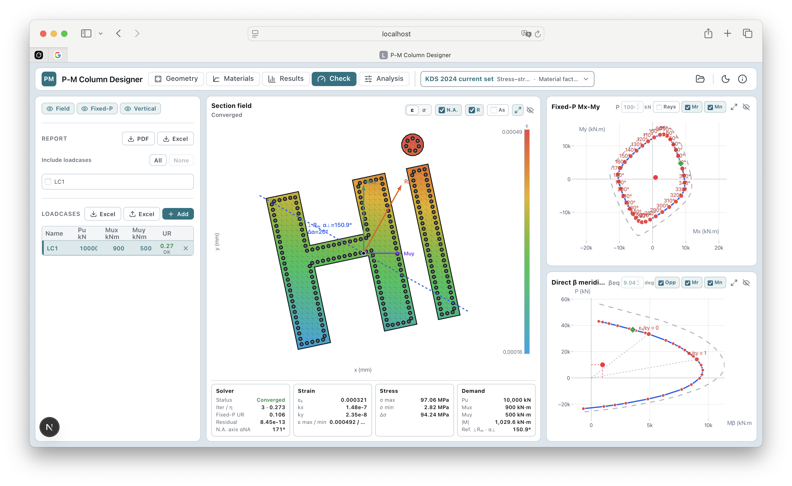

# P-M Column Designer

Browser-based reinforced-concrete cross-section analysis for axial force and biaxial bending
(`P-Mx-My`). The project is organized as reusable TypeScript packages with a Next.js frontend; the
engineering kernels run locally in the browser through a Web Worker.

**Live demo:** [https://pmdesigner.vercel.app/](https://pmdesigner.vercel.app/)

> [!IMPORTANT]
> **Current product boundary: Stage 1 — Section Resistance Only.**
>
> The application evaluates the resistance of a short reinforced-concrete **cross-section**. It is
> not a complete column/member design program and must not be presented as one.

## Product tour

From arbitrary reinforced-concrete geometry to an auditable `P-Mx-My` demand check. Click any
screenshot to inspect the full-resolution engineering detail.

<p align="center">
  <a href="docs/assets/screenshots/interaction-surface-and-slices.png">
    
  </a>
</p>
<p align="center">
  <strong>Resistance workspace</strong> — inspect the 3D design or nominal surface together with
  direct-β meridians, fixed-P contours and the underlying chart data.
</p>

<table>
  <tr>
    <td width="50%" valign="top">
      <a href="docs/assets/screenshots/geometry-editor.png">
        
      </a><br>
      <strong>Arbitrary section geometry</strong><br>
      Build multiple polygonal solids and openings, then place discrete reinforcement with visible
      point numbering and section properties.
    </td>
    <td width="50%" valign="top">
      <a href="docs/assets/screenshots/verified-section-mesh.png">
        
      </a><br>
      <strong>Verified numerical model</strong><br>
      Review the exact clipped mesh, integration-point count, mesh size and area-closure evidence
      before interpreting a resistance surface.
    </td>
  </tr>
  <tr>
    <td width="50%" valign="top">
      <a href="docs/assets/screenshots/mesh-gauss-points.png">
        
      </a><br>
      <strong>Mesh-level audit view</strong><br>
      Zoom into concrete triangles, Gauss points and reinforcement fibers; export the same audit
      model to Excel or DXF.
    </td>
    <td width="50%" valign="top">
      <a href="docs/assets/screenshots/directional-and-fixed-p-results.png">
        
      </a><br>
      <strong>Directional and fixed-P results</strong><br>
      Compare tabulated strain-domain stations, a selected bending direction, the complete 3D
      surface and an axial-force slice in one workspace.
    </td>
  </tr>
  <tr>
    <td colspan="2" valign="top">
      <a href="docs/assets/screenshots/demand-check-section-field.png">
        
      </a><br>
      <strong>Demand check and compatible section field</strong><br>
      Trace a factored loadcase from utilization and capacity intersections back to its converged
      strain field, neutral axis, stress range, solver residual and governing demand direction.
    </td>
  </tr>
</table>

## 1. Standard and verification status

**KDS is the only code family currently exposed as an engineering section-check workflow.** Other
standard-labelled profiles are calculation previews for development, comparison, and verification;
they are not released code checks.

| Standard/profile | Mechanics available | Current product status |
|---|---|---|
| KDS Main resistance-factor route | Stress-strain integration and equivalent rectangular block | Section check implemented; draft engineering status, not certified member design |
| KDS 14 20 20:2022 Appendix material-factor route | Stress-strain integration and equivalent rectangular block | Section check implemented; includes Appendix material factors, compression domains and minimum eccentricity; draft engineering status |
| ACI 318-19(22) | Equivalent rectangular block | **Preview only**; not an accepted/released code check |
| EN 1992-1-1:2004 | Stress-strain integration | **Preview only**; no National Annex selected and tensile domains remain limited |
| AS 3600:2018 Amendments 1 and 2 | Equivalent rectangular block | **Preview only**; section-shape and member-analysis limitations remain |
| Custom/User-defined | User-selected material or block parameters | Not a code check and carries no clause compliance claim |

“Implemented” means that the software route, equations, validation and regression tests exist. It
does **not** mean that the profile has completed independent professional review, jurisdictional
approval or commercial certification. The exact standard edition and resistance method are stored
in each project; the application never treats a family name such as `KDS` as an unspecified latest
edition.

### KDS routes must not be mixed

- **KDS Main:** characteristic material response, state-dependent resistance factor, followed by
  the applicable maximum axial-compression limit.
- **KDS Appendix:** design material strengths are reevaluated with the Appendix material factors;
  no Main-body resultant factor or Main-body axial cap is added. For compression demand it applies
  the demand-side rule

  ```text
  e_min = 15 + 0.03h mm
  M_min = Pu e_min
  ```

  The original load and the code-adjusted load are retained separately for audit.

Current KDS material applicability gates reject nonphysical definitions, reinforcement with
`fy > 600 MPa`, and use of default tabulated concrete parameters above `fck = 90 MPa`. A documented
modified user model is required outside the tabulated concrete range. The Appendix nonzero-biaxial
minimum-eccentricity direction remains an explicit project interpretation pending independent
clause sign-off, so the profile remains `draft`.

## 2. Scope of the project

### Included in Stage 1

- arbitrary polygonal concrete regions, multiple solids and holes;
- discrete reinforcement fibers with material assignments;
- nonlinear concrete and reinforcement material response;
- short-section `P-Mx-My` nominal and design resistance surfaces;
- factored ULS demand checks against a section-resistance surface;
- forward and inverse section calculations;
- fixed-grid and adaptive surface sampling with convergence evidence;
- three-state demand screening: `OK`, `NG`, or `CHECK` when sampling uncertainty crosses `UR = 1`;
- browser-side project import/export and reusable calculation packages;
- compact project information for project name, client, company, designer, checker, address and
  report date, persisted with the project and reused by PDF reports;
- PDF design-preview reports, calculation Excel workbooks, and stress-strain mesh Excel/DXF audit
  exports.

### Explicitly outside Stage 1

- column slenderness and effective length;
- first- or second-order structural/member analysis;
- sway/non-sway classification, geometric nonlinearity and buckling/stability;
- frame analysis or generation of load combinations;
- shear, torsion, fatigue, fire and seismic member checks;
- serviceability, cracking and long-term deformation;
- reinforcement detailing, cover, spacing, anchorage and development length;
- foundation, connection or global structural design;
- automatic legal selection of the governing jurisdiction, standard edition or National Annex;
- a signed/certified design result replacing the responsible structural engineer's review.

Input actions are already-factored section resultants. The program does not calculate those actions
from a structural model.

## 3. Two independent calculation methods

The project deliberately keeps two mechanics pipelines independent. They share geometry,
materials, design-basis contracts, result conventions and reporting interfaces, but they do not
share a hidden numerical capacity formula.

| Method | Concrete calculation | Reinforcement calculation | Main purpose |
|---|---|---|---|
| **Stress-strain integration** | Integrates the selected material law over a verified triangular/quadrature mesh | Integrates each discrete reinforcement fiber from the compatible strain plane | General nonlinear section response and material-law studies |
| **Equivalent rectangular stress block** | Clips the compression block exactly against concrete polygons and holes, then integrates the clipped geometry | Evaluates bar strain/stress and subtracts displaced concrete where required | Code-specific rectangular-block calculations and auditable force ledgers |

Both methods use the same project sign convention:

```text
compression P is positive
Mx = Σ F (y - yc)
My = Σ F (x - xc)
```

The equivalent-block method is not a coarse mesh approximation of the stress-strain method. It is a
separate mechanics model with its own forward evaluator, surface construction, inverse solver and
verification fixtures.

## 4. Forward and inverse calculations

### Forward calculation

The forward problem starts from a compatible section state and returns section resultants.

```text
section + reinforcement + materials + strain/neutral-axis state
                              ↓
                         P, Mx, My
```

- Stress-strain: a strain plane `(ε0, κx, κy)` is evaluated over the concrete quadrature points and
  reinforcement fibers.
- Equivalent block: neutral-axis direction/depth and the selected strain domain define the clipped
  compression block and reinforcement states.

Repeated forward evaluations generate the nominal and design `P-Mx-My` resistance surfaces. This is
a section calculation only; it does not determine structural actions or member stability.

### Inverse calculation

The inverse problem starts from a factored section demand and searches for the compatible state and
capacity intersection.

```text
factored demand Pu, Mux, Muy + design resistance surface
                              ↓
       utilization + capacity point + compatible section state
```

- Stress-strain uses the prepared fibers, surface intersection and Newton equilibrium refinement.
- Equivalent block uses its proportional-ray surface solver and exact block equilibrium refinement.
- Code demand rules such as KDS Appendix minimum eccentricity are applied before solving, while the
  original user-entered demand is preserved.
- Adequacy, solver convergence and strain admissibility are separate results. A surface fallback or
  an axial-cap-face intersection is never misreported as a unique converged material state.

Inverse calculation does not perform frame analysis, magnify moments, or create load combinations.

## 5. Sampling and result interpretation

The fixed production schedule uses the shared `unified-27-v2` strain-domain station set and 36
directions. Adaptive mode starts from a smaller seed and refines stations and directions against the
configured tolerances.

Fixed-grid utilization uses a documented screening uncertainty. A demand is:

- `OK` only when the complete utilization interval is at or below `1.0`;
- `NG` only when the complete interval is above `1.0`;
- `CHECK` when the interval crosses `1.0` or sufficient numerical evidence is unavailable.

`CHECK` is not a pass. Rerun with Adaptive sampling and review the convergence evidence.

## 6. Browser workflow

The web application is organized around these workspaces:

1. **Geometry** — concrete regions, openings and reinforcement;
2. **Materials** — code/method selection and material definitions;
3. **Section Results** — nominal/design resistance surface and section slices;
4. **Demand Check** — factored load combinations, utilization, inverse state and report export;
5. **Analysis Options** — fixed/adaptive sampling and numerical controls.

Production calculations run in a browser Web Worker. A calculated surface is cached in the worker
and subsequent loadcase checks reference it by handle rather than repeatedly cloning the complete
surface from the UI thread.

## 7. Repository structure

```text
apps/web/                              Next.js browser application and section editor
packages/pm-geometry/                  Geometry, containment, clipping and integration mesh
packages/pm-materials/                 Persisted materials, validation and compiled laws
packages/pm-project/                   Versioned project schema and calculation-profile DTOs
packages/pm-stations/                  Shared strain-domain station definitions
packages/pm-design/                    Resistance profiles, factors and code demand rules
packages/pm-results/                   Shared adequacy and uncertainty classification
packages/pm-analysis/                  Stress-strain forward/inverse/surface kernel
packages/pm-equivalent-block/          Standard-independent rectangular-block kernel
packages/pm-code-kds142020/            KDS equivalent-block adapter
packages/pm-code-aci318/               ACI preview adapter
packages/pm-code-en1992/               EN preview adapter
packages/pm-code-as3600/               AS preview adapter
packages/pm-code-custom/               User-defined block adapter
packages/pm-analysis-equivalent-block/ Project/result bridge for block profiles
packages/pm-report/                    PDF, Excel and DXF audit/report outputs
docs/engineering/                      Engineering scope, meaning and acceptance rules
docs/development/                      Architecture, schema, UI, test and release guidance
```

Documentation starts at [`docs/00-README.md`](docs/00-README.md). Calculation models and defaults
are described in
[`docs/12-calculation-models-defaults-and-workflows.md`](docs/12-calculation-models-defaults-and-workflows.md).

## 8. Development and verification

Install the pinned dependencies and start the frontend:

```bash
npm ci
npm run dev
```

The local web app uses [http://localhost:3001](http://localhost:3001) by default, leaving port 3000
available for other projects. `npm start` uses the same port after a production build.

Primary verification commands:

```bash
npm run typecheck
npm test
npm run build
npm run bench:verify
npm run bench:strain-sampling
npm run bench:equivalent-block
npm run bench:pipelines
```

The automated suite covers material/geometry rejection, station and surface regressions, both
mechanics, forward/inverse agreement, KDS Main/Appendix separation, minimum eccentricity, project
round trips, CAD behavior, independently recalculated Excel outputs and deterministic PDF structure.
Reference workbooks and benchmarks are regression evidence, not design-code authority.

## 9. Engineering disclaimer

This repository is under active development. Results must be reviewed by a qualified structural
engineer against the governing project documents, jurisdiction, standard edition, amendments and
independent calculations. Preview profiles and preview reports must not be used as certified design
deliverables.

## 10. Open-source license and attribution

Copyright © 2026 **Envico Co., Ltd.**

Originally developed by **Le Xuan Hung**.

P-M Column Designer is open-source software released under the
[MIT License](LICENSE). You may use, copy, modify, merge, publish, distribute, sublicense and sell
copies of the software, including for commercial use, subject to the MIT License. The copyright and
permission notice must be included in all copies or substantial portions of the software.

Community discussion, forks and pull requests are welcome. By submitting a contribution, you agree
to license it under the same MIT License; see [CONTRIBUTING.md](CONTRIBUTING.md). Attribution to the
original project and developer is recorded in [NOTICE](NOTICE).

The MIT License does not require forks or modifications to be published or contributed back. It
provides the software without warranty and does not certify any structural-engineering result.

Individual third-party packages, fonts, assets and normative references remain subject to their own
licenses and copyright terms.
