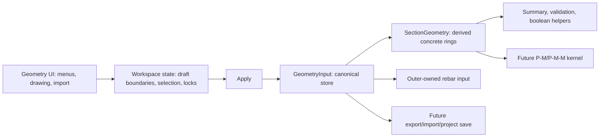

# Geometry Input Pipeline

Geometry is the user-input boundary of the product. The editor, menus, quick generators, imports, and future CAD tools should all write the same canonical data shape before any analysis module consumes it.

## Canonical Store

Use `GeometryInput` from `@pm/geometry` as the persisted geometry input model:

```ts
type GeometryInput = {
  id: string
  name: string
  unit: 'mm'
  outers: Array<{
    id: string
    points: Array<{ id: string; x: number; y: number }>
    holes: Array<{
      id: string
      points: Array<{ id: string; x: number; y: number }>
    }>
    rebars: Array<{
      id: string
      dia: number
      x: number
      y: number
    }>
  }>
}
```

This is intentionally input-shaped, not solver-shaped. Multiple disconnected concrete regions are represented by multiple `outers`. Each outer owns its own holes and rebars. Point IDs and rebar IDs must remain unique across the whole geometry input, even when they belong to different outers.

## Pipeline



`SectionGeometry` remains the concrete-analysis adapter used by geometry math helpers. It should be derived from `GeometryInput` through `sectionGeometryFromGeometryInput`, not stored as a parallel source of truth in the app.

## Ownership

- UI-only concerns such as selected boundary, draw tool, visibility, lock state, and shape source metadata stay inside the editor workspace.
- `GeometryInput` owns applied concrete geometry and rebar input. Rebars are stored under their parent outer, while UI views may flatten them temporarily for tables/rendering.
- Analysis modules should accept `GeometryInput` or an explicit derived object, but they should not depend on editor workspace state.
