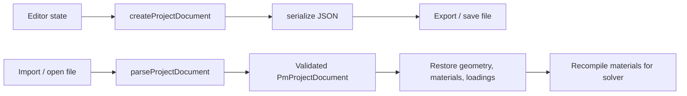

# Project Document Pipeline

Canonical JSON document for save / open / interchange of all engineering inputs.
Editor-only state (camera, selection, draft boundaries, locks) is intentionally excluded.

## Document shape

```ts
type PmProjectDocument = {
  schema: 'pm-column-project'
  version: 2
  meta: {
    id: number
    name: string
    createdAt: string
    updatedAt: string
  }
  inputs: {
    geometry: GeometryInput
    materials: MaterialStore
    loadings: LoadingsInput
  }
}
```

### Implicit units (not written to JSON)

| Quantity | Unit |
|---|---|
| Length / coordinates | mm |
| Force (P) | N |
| Moment (Mx, My) | N·mm |
| Stress (fck, fy, …) | MPa (N/mm²) |

### Entity ids

All entity ids are positive integers starting at 1, shared between UI and JSON.
Each entity kind has its own id space (points, outers, holes, rebars, steel materials, load combinations, …).
Concrete material id is always `1`. New ids use the smallest unused integer (gap-fill).

`inputs` is the extension point for future modules. Additive fields under `inputs`
should remain optional or defaulted so older v2 files still open. Bump `version` for breaking changes.

## Pipeline



## Rules

- Persist definition data only. Never serialize `CompiledMaterial` function objects.
- On open, recompile materials with `compileMaterialStore`.
- Geometry comes from `GeometryInput`, not draft workspace boundaries.
Entity ids use `@pm/ids` (`nextAvailableId` gap-fill across each entity namespace).
Concrete material id is fixed at `1`. Do not write unit fields into JSON.
